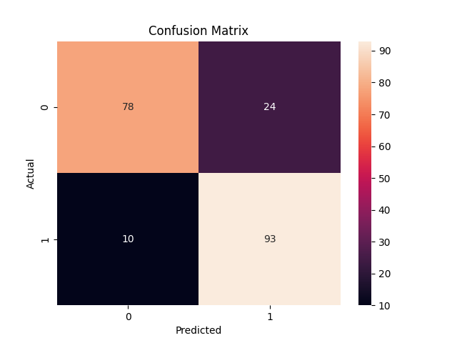

# ❤️ Heart Disease Classification using KNN

## 📌 Project Overview
This project predicts the presence of heart disease using machine learning based on medical attributes.

---

## 📊 Dataset
The dataset contains important medical features such as:

- Age  
- Sex  
- Chest Pain Type  
- Resting Blood Pressure  
- Serum Cholesterol  
- Fasting Blood Sugar  
- Resting ECG  
- Maximum Heart Rate  
- Exercise Induced Angina  
- Oldpeak (ST depression)  
- Slope, CA, Thal  

Sensitive information like names and SSNs has been removed.

---

## 🧠 Workflow

1. Data Cleaning  
   - Handled missing values using median  
2. Data Preprocessing  
   - Feature scaling using MinMaxScaler  
3. Outlier Treatment  
   - Applied IQR method for capping outliers  
4. Exploratory Data Analysis (EDA)  
   - Count plots, heatmaps, pairplots  
5. Model Training  
   - K-Nearest Neighbors (KNN)  
6. Model Tuning  
   - Tested multiple K values (3 to 50)  
7. Evaluation  
   - Accuracy score  
   - Confusion matrix  
   - Classification report  

---

## 🤖 Model Used

**K-Nearest Neighbors (KNN)**  
- Simple and effective for classification problems  
- Works well with scaled data  
- Optimal K value selected after testing multiple values  

---

## 📈 Results

- **Accuracy: 83%**  
- Good balance between bias and variance  

### 📊 Confusion Matrix


---

## 📊 Visualizations
- Age distribution  
- Gender distribution  
- Chest pain analysis  
- Correlation heatmap  
- Pairplot relationships

---
## 📊 Model Evaluation

| Model                | Accuracy |
|---------------------|---------|
| KNN                 | 83%     |
| Logistic Regression | 80.98%  |
| Random Forest (Tuned) | 84.87%  |

---

### 🔁 Cross-Validation
- Random Forest (5-fold CV): **90.15%**

---

## 🧠 Insights

- KNN performed well after scaling.
- Logistic Regression provided a baseline linear model.
- Random Forest initially overfit (~98% accuracy), but after tuning, it achieved balanced performance.
- Cross-validation score (90.15%) confirms that the model generalizes well across different data splits.
- Random Forest is selected as the final model due to its stability and performance.

---


## ⚙️ Tech Stack

- Python  
- Pandas  
- NumPy  
- Scikit-learn  
- Matplotlib  
- Seaborn  

---

## 🚀 How to Run

```bash
pip install -r requirements.txt
python main.py

